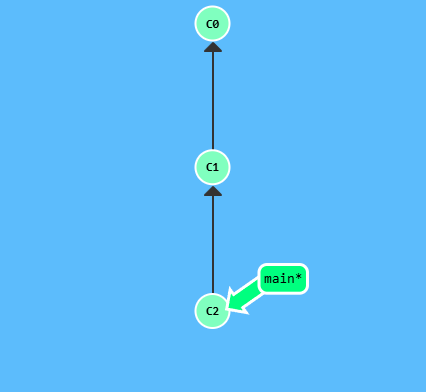

## About Git Commits
* A commit in a git repository records a snapchat of all the tracked files in a directory.
* Git is lightweight meaning it can (when possible) compress a commit as a set of changes, or a "delta", from one version of the repository to the next.
* Maintains history of which commits were made when. 

## Git Demonstration

  

This is a visualization of a (small) git repository. There are currently two commits right now. The first initial commit, `C0`, and one commit `C1` that might have some meaningful changes. 

If we were to type in `git commit` then `C2` would be our second commit.

  

***
