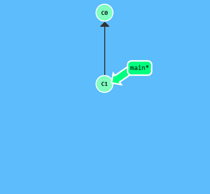
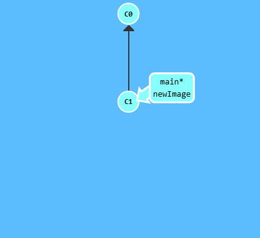
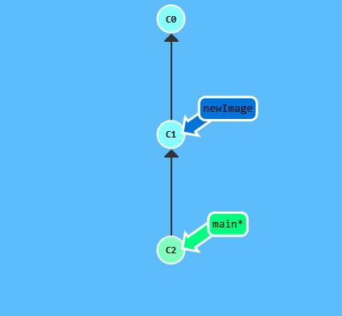
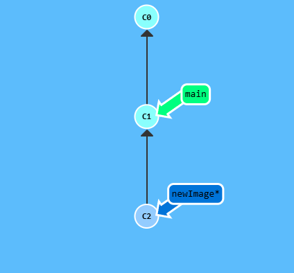

## About Git Branches
* They are incredibly lightweight and are simply pointers to a specific commit. This is the reason why many Git enthusiasts chant the mantra: **branch early, and branch often**
* There is no storage / memory overhead with making many branches, it's easy to logically divide up your work than having big beefy branches.

> A branch essentially says, " I want to include the work of this commit and all parent commits"

## Git Demonstration

  

Here we will create a new branch called `newImage` using the command `git branch newImage`

  

The branch `newImage` now refers to commit `C1`. Let's try to put some work on this new branch by inputting the `git commit` command.

  

The `main` branch moved but the `newImage` branch didn't. This is because we were not "on" the new branch, which is why the asterisk ( `*` ) was on `main`.

To put us on our new branch before committing our changes we need to input the command `git checkout -b <name>` then `git commit`

  

There we go! Our changes were recorded on the new branch.

