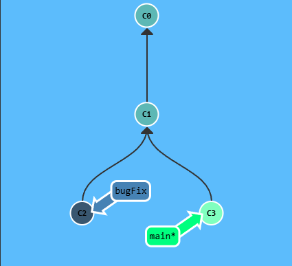
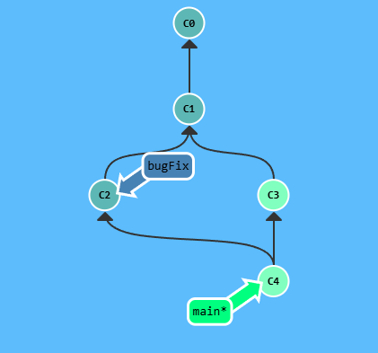
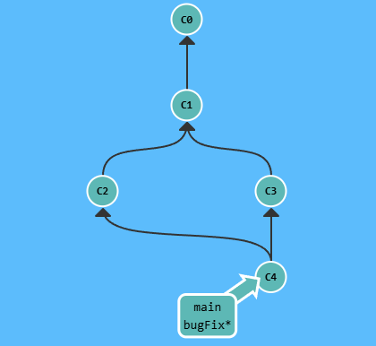

We need to learn some kind of way of combining the work from two different branches together. This will allow us to branch off, develop a new feature, and then combine it back in.

The first method that we will examine is `git merge`. Merging in Git creates a special commit that has two unique parents. 

>   A commit with two parents essentially means "I want to include all the work from this parent over here and this one over here, and the set of all their parents"

___

Here we have two branches; each has one commit that is unique. This means that neither branch includes the entire set of "work" in the repository that we have done. Let's fix that with merge.
<p align="center">  </p>

We will `merge` the branch `bugFix` into `main` using the command `git merge bugFix`

<p align="center">  </p>

`main` now points to a commit that has two parents. If you follow the arrows up the commit tree from `main`, you will hit every commit along the way to the root. This means that `main` contains all the work from the repository now.

Notice how the colors of the commits changed? To help with learning, there is color coordination. Each branch has a unique color. Each commit turns a color that is the blended combination of all the branches that contain that commit.

Here we see that the `main` branch color is blended into all commits, but the `bugFix` color is not. Let's fix that.

Let's merge `main` into `bugFix` using:

```
git checkout bugFix
git merge main
``` 

<p align="center">  </p>

Since `bugFix` was an ancestor of `main`, git didn't have to any work; it just simply moved `bugFix` to the same commit `main` was attached to.

Now all the commits are the same color, which means each branch contains all the work in the repository.