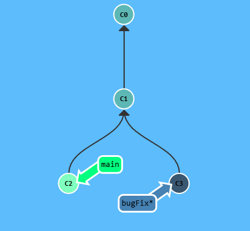
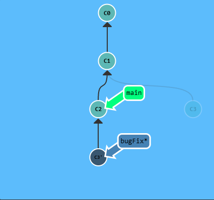
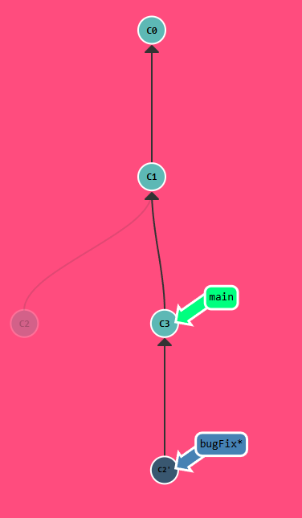

## Git Rebase

The second way of combining work between branches is *rebasing*. Rebasing essentially takes a set of commits, "copies" them, and plops them down somewhere else.

The advantage of rebasing is that it can be used to make a nice linear sequence of commits. The commit log / history of the repository will be a lot cleaner is only rebasing is allowed.

---

Here we have two branches yet again; note that the `bugFix` branch is currently selected (note the asterisk),

We would like to move our work from `bugFix` directly onto the work from main. The way it would like these two features were developed sequentially, when in reality they were developed in parallel.

<p align="center">  </p>

Let's do that with the `git rebase` command.

<p align="center">  </p>
Now we are checked out of the `main` branch. Let's go ahead and rebase onto `bugFix` using `git rebase bugFix`

<p align="center">  </p>
Since `main` was an ancestor of `bugFix`, git simply moved the `main` branch reference forward in history.

## Puzzle

<p align="center">  </p>

## Solution

```
git branch bugFix
git checkout bugFix
git commit
git checkout main
git commit
git checkout bugFix
git rebase main
```