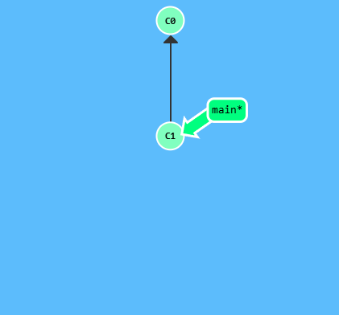
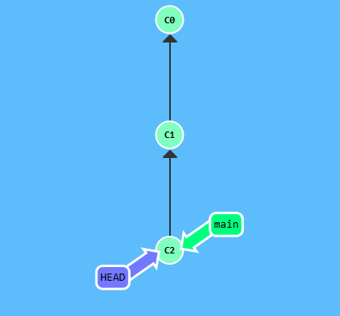
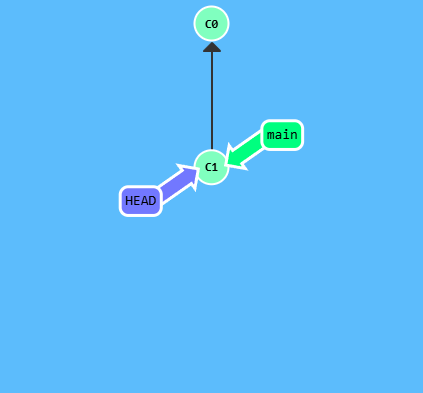
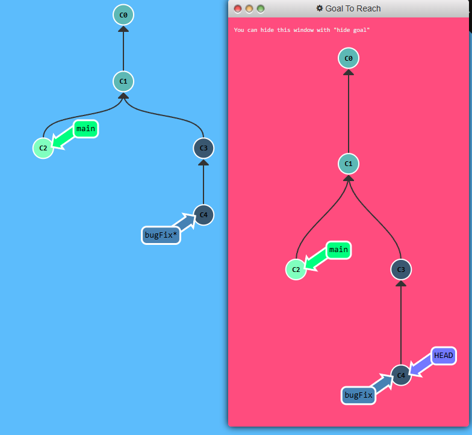

## About HEAD

HEAD is the symbolic name for the currently checked out commit -- it's essentially what commit you're working on top of.

HEAD always points to the most recent commit which is reflected in the working tree. Most git commands which make changes to the working tree will start by changing HEAD.

Normally HEAD points to a branch name like (like bugFix). When you commit, the status of bugFix is altered and this change is visible through HEAD.

---

<p align="center">  </p>

Let's see this in action. Here will reveal HEAD before and after a commit.

```
git checkout C1
git checkout main
git commit
git checkout C2
```

<p align="center">  </p>

HEAD was hiding underneath our `main` branch all along.

Detaching HEAD just means attaching it to a commit instead of a branch. This is what it looks like beforehand:

<p align="center">  </p>

HEAD -> main -> C1. Now let's see what happens when we checkout of C1 using `git checkout C1`

<p align="center">  </p>

And now it's HEAD -> C1


## Puzzle

<p align="center">  </p>
## Solution

```
git checkout C4
```