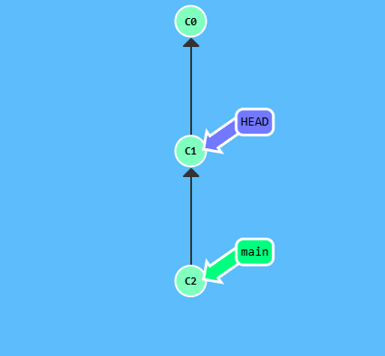
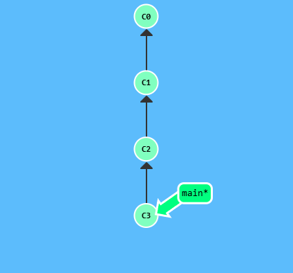
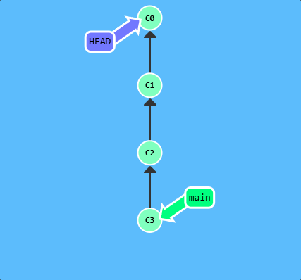
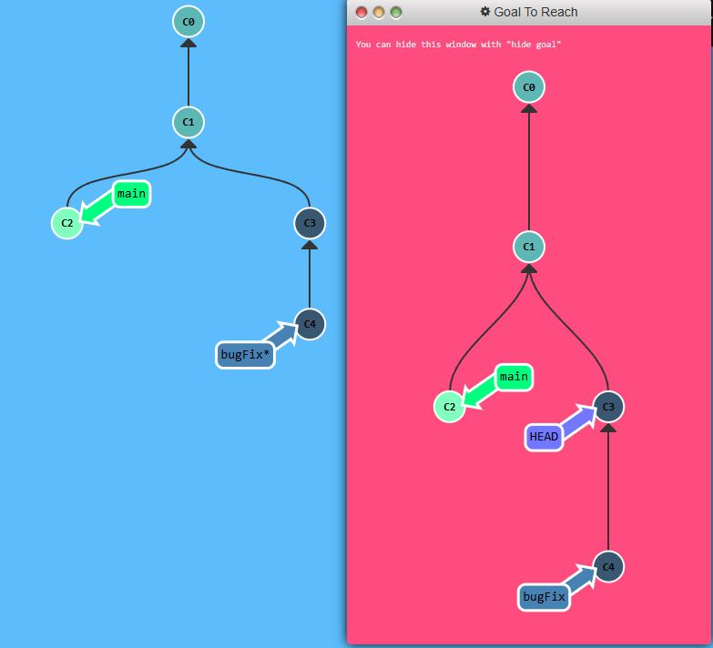

## Hashes in Git

Moving around in Git by specifying commit hashes can get a bit tedious. In the real world, you won't have a nice commit tree visualization next to your terminal, so you'll have to use `git log` to see hashes.

Hashes are usually a lot longer in the real Git world as well. For instance, the hash of the commit that introduced the previous level `fed2da64c0efc5293610bdd892f82a58e8cbc5d8`. 

The upside is that Git is smart about hashes. It only requires you to specify enough characters of the hash until it uniquely identifies the commit. So I can type `fed2` instead of the long string above.

Specifying commits by their hash isn't the most convenient thing ever which is why Git has relative refs.

**Relative Refs** you can start somewhere memorable like the branch `bugFix` or `HEAD` and work from there.

Relative commits are powerful, but we will introduce two simple ones here:

* Moving upwards one commit at a time with `^`
* Moving upwards a number of times with `~<num>`

---

Let's look at the Caret (^) operator first. Each time you append that to a ref name, you are telling Git to find the parent of the specified commit. So saying `main^` is equivalent to "the first parent of `main`"

`main^^` is the grandparent (second-generation ancestor) of `main`

Let's check out the commit above main here:


<p align="center">  </p>

```
git checkout main^
```

<p align="center">  </p>

---

You can also reference `HEAD` as a relative ref. Let's use that a couple of times to move upwards in the commit tree.

<p align="center">  </p>
```
git checkout C3
git checkout HEAD^ # Moves HEAD to C2
git checkout HEAD^ # Moves HEAD to C1
git checkout HEAD^ # Moves HEAD to C0
```

<p align="center">  </p>

We can travel backwards with `git checkout HEAD^`

## Puzzle

<p align="center">  </p>

## Solution

```
git checkout HEAD^
```