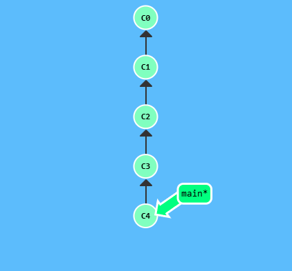
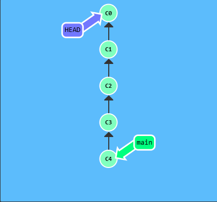
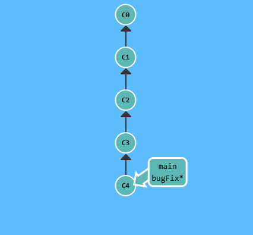
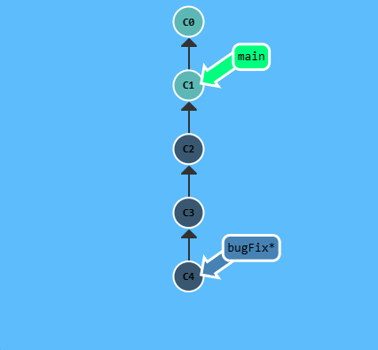
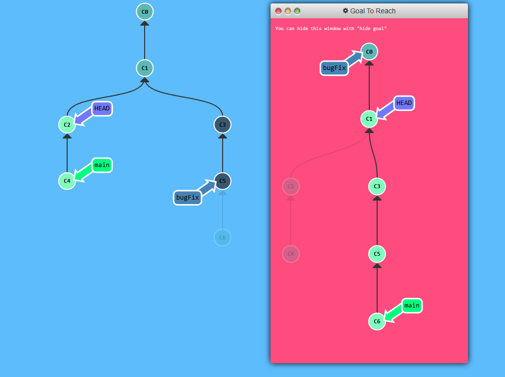

Let's specify a number of commits back with `~`

<p align="center">  </p>

```
git checkout HEAD~4
```

<p align="center">  </p>

## Branch forcing

One of the most common ways to use relative refs is to move branches around. You can directly reassign a branch to a commit with the `-f` option. So something like:

```
git branching -f main HEAD~3
```

Moves (by force) the main branch to three parents behind HEAD. 

> In a real git environment `git branch -f` command is not allowed for your current branch


<p align="center">  </p>

```
git branch -f main HEAD~3
```

<p align="center">  </p>
Relative refs gave us a concise way to refer to `C1` and branch forcing (`-f`) gave us a way to quickly move a branch to that location.

## Puzzle

<p align="center">  </p>
## Solution

```
git branch -f main C6
git checkout HEAD~1
git branch -f bugFix HEAD~1
```